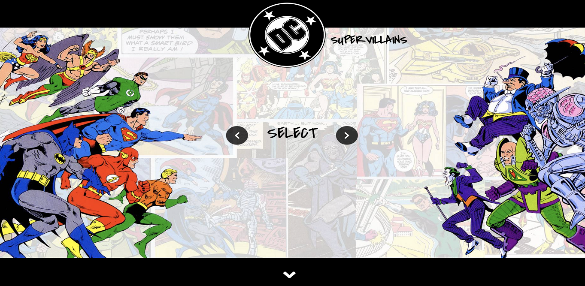
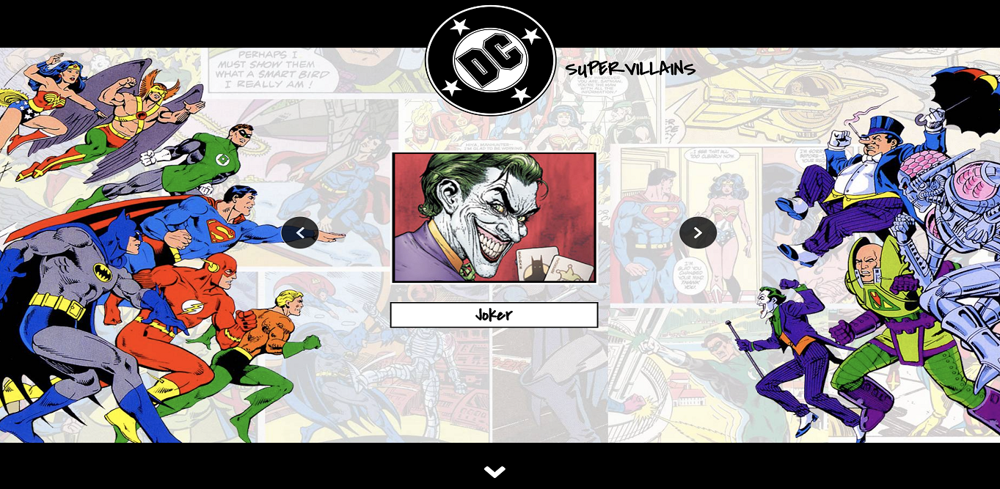
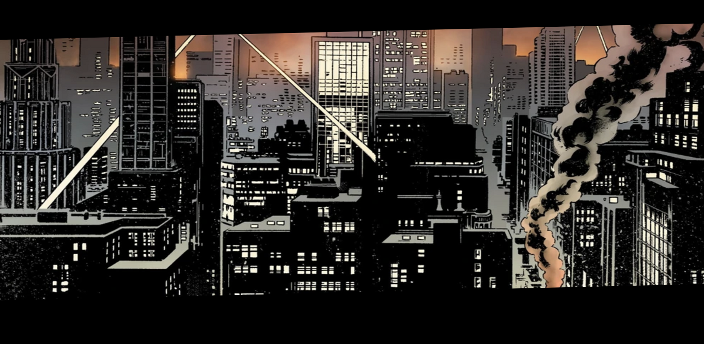
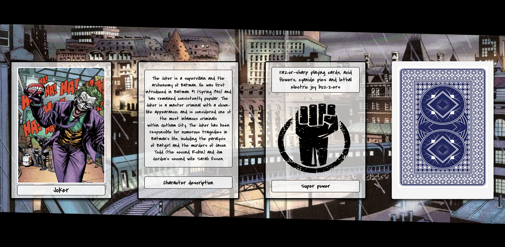
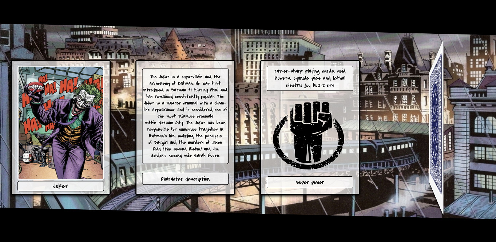
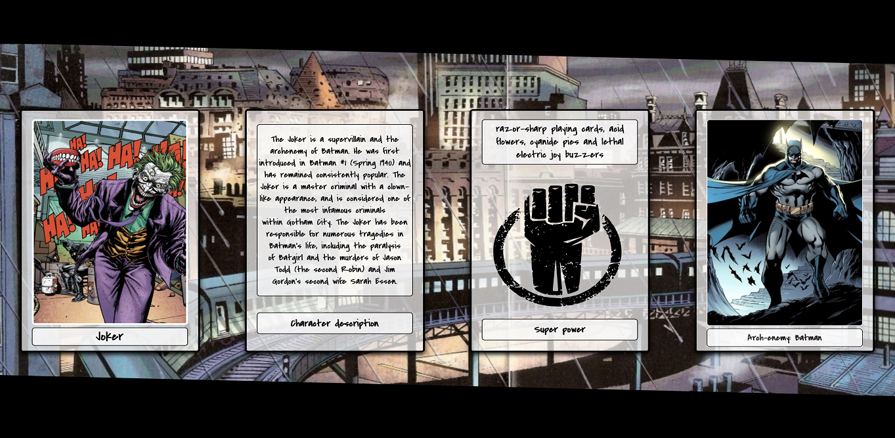
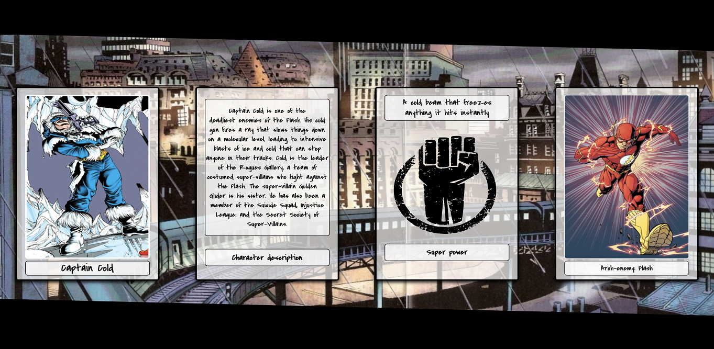
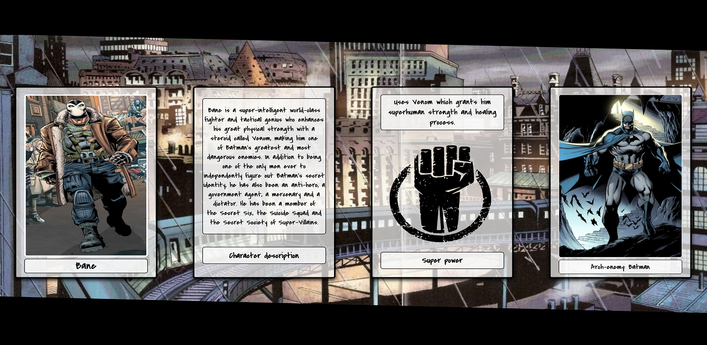

# DC Supervillains (Updated version)

Updated version of DC Supervillains gallery. This project is a full-stack MERN (MongoDB, Express, React and Node.js) application. It also includes Parallax effects and CSS carousel.

Tools and technologies used:

- React
- JavaScript
- Node.js
- Express
- Axios
- HTML / CSS

## **Heroku**

This app has been deployed to Heroku:

https://dc-supervillains-mern.herokuapp.com/

---

|                                                          Description                                                          |                       Image                       |
| :---------------------------------------------------------------------------------------------------------------------------: | :-----------------------------------------------: |
|                                                   User enters the main page                                                   |  |
|                                 User can select a supervillain by clicking the arrow buttons                                  |  |
|                                  User can scroll down to view the supervillain's information                                  |  |
|                                                  Supervillain overview part                                                   |  |
|                                     The card on the right end of the page flips on hover                                      |  |
|                                    The card on the right reveals supervillain's Arch-enemy                                    |  |
|                                           Each supervillain has his own Arch-enemy                                            |  |
| Each supervillain has also different description and super powers. All of these pieces of information are taken from database |  |

---
